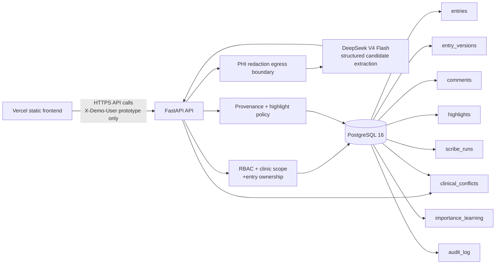
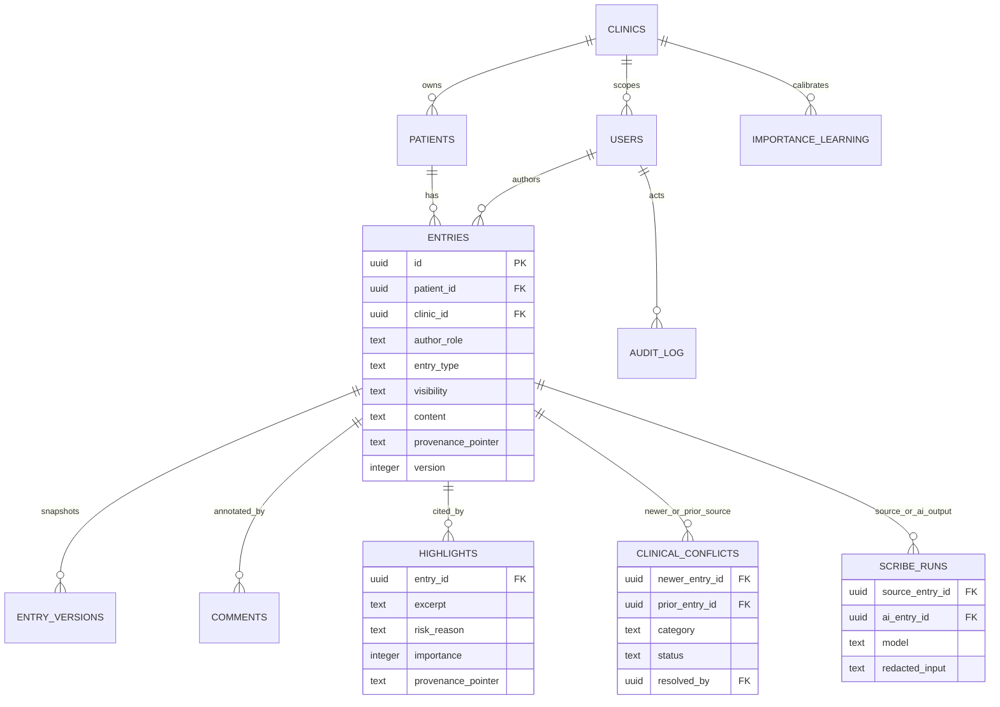

# CareTrace technical brief

## Decision in one sentence

CareTrace makes a small number of clinically relevant claims easy to verify: a shared timeline is the source of truth, every Glance View card points back to a source entry, and no role can silently see or overwrite work it is not authorised to access.

## Why this scope

The failure mode in longitudinal care is not a lack of prose; it is losing context and trust while trying to find the next action. A generic collaborative editor would make a weak demo because it obscures authorship and provenance. This build therefore prioritises four hard guarantees over voice capture, CRDTs, or free-form generation:

1. A consult-ready Glance View that can be read in seconds.
2. A longitudinal, role-labelled source of truth.
3. Server-enforced access and immutable revision/audit trails.
4. Deterministic, inspectable prioritisation with bounded feedback—not an opaque risk score.

## Architecture

`docker compose up --build` creates the backend and database containers. The Next.js `frontend/` directory deploys independently to Vercel; its public `NEXT_PUBLIC_API_BASE_URL` points to the API. PostgreSQL owns durable state; FastAPI initializes schema and clearly synthetic seed data. FastAPI holds no permission state in the client. The selector in the demo sets an `X-Demo-User` header, which the API resolves against `users`; production replaces this only with verified session/JWT claims. CORS permits only explicit configured origins, including the deployed Vercel URL.

The AI scribe uses DeepSeek V4 Flash only from FastAPI. Synthetic source text is first redacted, then submitted with a strict JSON contract for a non-diagnostic candidate summary, candidate facts, open actions, risk signals, or an explicit abstention reason. One source transcript entry and one `system` AI-scribed entry are committed together with a `scribe_runs` record containing the redacted input, model, prompt version, and output. The AI entry's pointer resolves back to the exact source transcript. A malformed provider response, unavailable provider, or missing key fails closed: no timeline entry is created.

### Data schema and lineage

An AI-scribed entry has `author_role=system`, a distinct `entry_type`, and the upstream session/consult pointer. A generated highlight stores a second, local pointer in the strict format `timeline:<entry id>#source`; the client uses that pointer to navigate to the exact producing entry. This is intentional extraction-orientation: we make source content visible rather than presenting an ungrounded paraphrase as fact.

`clinical_conflicts` is deliberately separate from ordinary highlights. It records two source-entry foreign keys, a deterministic category (`allergy`, `medication_dose`, or `care_plan`), and a clinician-only decision. The Glance View sends the reviewer to both entries; a clinician may confirm the newer record or retain the earlier one. Neither the detector nor DeepSeek overwrites a source record or resolves a disagreement.

## Access, privacy, and concurrency

Each endpoint first retrieves the actor, then checks clinic equality. The patient role receives only clinician-approved `visibility=patient` entries; raw AI, internal staff/clinician notes, comments, audit, and internal highlights are never serialized. Staff can add staff notes and only edit their own; clinicians can add/edit clinician sections; admins have read-only audit oversight. These are API checks, not disabled buttons.

Every edit carries `expected_version`. PostgreSQL only updates when the current version matches, so same-entry concurrent changes resolve deterministically as an HTTP 409—not last writer wins. A successful edit writes an `entry_versions` snapshot and metadata-only audit event in the same transaction. Revert creates a new version containing the requested old snapshot, preserving history.

All demonstration data is synthetic. Before every DeepSeek request, text passes a redaction egress function for titled names, identity numbers, and phones. The provider credential remains server-side; no raw key, request authorization header, or raw provider response is put into audit logs. Production additionally needs authenticated identity, database-at-rest encryption, TLS, secret management, PII evaluation, tenant RLS, and a clinical safety review.

## Importance, evaluation, and restraint

A score is only useful if its behaviour is clear. This prototype has two components:

- A deterministic floor for explicit high-risk tags and phrases such as allergy, escalation, or urgent symptoms. It protects against feedback fatigue.
- A small, capped feedback bump when a care-team member accepts a suggestion from the same entry type. Rejection does not demote the deterministic floor.

The Glance View exposes the risk reason and source. Clinicians and staff can accept/reject a suggestion. Acceptance adds a persisted, capped `+5` same-entry-type weight for future suggestions; rejection is recorded but cannot demote a deterministic high-risk floor. The system does not claim predictive confidence or make diagnoses. A real evaluation would measure source-link resolution rate, clinician accept/reject rate stratified by risk class, time-to-action, false-negative review, and alert burden. Feedback should be sampled across non-surfaced items to reduce exposure bias.

## Trade-offs and next steps

Voice capture, CRDT editing, and full data decay are intentionally omitted. They add clinical and privacy risk without improving the core demo’s trust guarantees. The implemented LLM path is limited to redacted, internal candidate extraction; it never writes patient-facing content. Next, add hospital identity integration, PostgreSQL row-level security, a background summarization queue, a broader clinically validated conflict vocabulary, controlled patient-summary approval workflows, and real P95 load testing.
